# Phase 3.5 — Platform Validation Report

**Date:** August 1, 2026
**Scope:** End-to-end infrastructure validation of the Plugin SDK + Event Pipeline, before any Adaptive AI Engine work begins.
**Explicitly out of scope:** AI logic, player modeling, pattern recognition — none of that exists yet and none was touched.

---

## 1. What Was Actually Found (read this before the checklists)

Before writing a single validation test, I audited the actual code against `IMPLEMENTATION_STATUS.md` / `PHASE_3_STATUS.md`, which described Phase 3 as "40% complete, HTTP API still needed." **That status doc was stale.** The real state of `platform/event-pipeline/src/`:

| Claimed missing | Actual state |
|---|---|
| Express HTTP API | ✅ Fully implemented (`router.ts`, 6 endpoints) |
| JWT auth & rate limiting | ✅ Fully implemented (`auth.ts` — HMAC match tokens, `rate-limiter.ts` — sliding window) |
| Observability | ✅ Fully implemented (`logger.ts`, `metrics.ts` — Prometheus exposition, `health.ts`) |
| Integration tests | ✅ 8 integration tests already existed (`__tests__/integration.test.ts`) |

Baseline before this phase: **86 event-pipeline tests + 66 SDK tests = 152 passing.** This validation phase added **44 new tests** (functional + security + stress) on top, all under `platform/event-pipeline/validation/`. **Total: 196 tests, all passing.**

Recommendation: treat `IMPLEMENTATION_STATUS.md` and `PHASE_3_STATUS.md` as stale and regenerate them from actual code state, not from session memory — this is how a fully-built HTTP+auth+observability layer got reported as "not started."

---

## 2. Architecture Under Test

```mermaid
flowchart LR
    subgraph Plugin["Validation Plugin (simulated)"]
        P1[dummy-game]
        P2[fast-action-game]
        P3[edge-case-plugin]
    end

    subgraph SDK["Plugin SDK (platform/sdk)"]
        Client[Client SDK<br/>emit / getLegalActions / submitDecision]
        Proto[Protocol<br/>types, messages, version negotiation]
        Host[Host SDK<br/>iframe mount, postMessage relay]
    end

    subgraph Pipeline["Event Pipeline (platform/event-pipeline)"]
        Auth[auth.ts<br/>HMAC match tokens]
        RL[rate-limiter.ts<br/>sliding window, per-match]
        Router[router.ts<br/>POST /events/batch, GET replay/health/metrics]
        Val[validation.ts<br/>schema, seq, timestamp]
        Proc[event-processor.ts<br/>dedup, ordering, persist]
        Store[event-store.ts<br/>indexes, queries]
    end

    DB[(MongoDB<br/>gameplayEvents / eventBatches)]
    Obs[logger.ts + metrics.ts<br/>/events/health, /events/metrics]

    P1 & P2 & P3 --> Client --> Proto --> Host
    Host -- "HTTP batch (this validation bypasses\niframe/postMessage — see §3.5)" --> Auth
    Auth --> RL --> Router --> Val --> Proc --> Store --> DB
    Router --> Obs
```

**Note on the SDK↔Pipeline boundary tested here:** the validation plugins submit events as HTTP batches matching exactly what the Host SDK produces after stamping match context — this exercises the full pipeline contract. The iframe/postMessage transport itself (browser-only, no DOM in this Node validation environment) is validated separately by the existing `platform/sdk/host` jsdom test suite; see §5.

---

## 3. Validation Checklist

### 3.1 Event Validation

| Item | Status | Evidence |
|---|---|---|
| No event loss | ✅ | `functional.test.ts`: dummy-game and fast-action-game scenarios assert `totalAccepted === totalSent` and replayed `eventCount` matches exactly |
| Correct ordering | ✅ | Replayed `seq` arrays assert strictly ascending / dense, no gaps, for both scenarios |
| Replay correctness | ✅ | Replayed event content (`type`, `payload`, `matchId`) matches submitted content byte-for-byte |
| Duplicate rejection | ✅ | Cross-batch and within-batch duplicate `seq` rejected with `"Duplicate event sequence number"` |
| Sequence recovery (gaps) | ✅ | A seq gap (e.g. jumping straight to seq 50) is **accepted and logged**, not rejected — see finding below |
| Timestamp consistency | ✅ | Future timestamps (>60s ahead) rejected (400); missing `ts` gets server-stamped; >24h-old `ts` accepted with a warning |
| Schema versioning | ✅ | Every stored event carries `schemaVersion` stamped by the processor, verified in replay |
| Batch correctness | ✅ | Empty batches, oversized batches (>`maxBatchSize`), non-array `events`, non-object bodies all rejected with 400 |

**Finding (behavioral, not a bug):** `validateSequencing()` in `validation.ts` never actually returns `{valid: false}` for out-of-order events within a batch — it only sets an `outOfOrder` flag that gets logged as a warning. An internally out-of-order batch (`seq: [5, 3]`) is **accepted**, not rejected. This is a soft-validation design choice (see recommendation §7).

### 3.2 Database Validation

| Item | Status | Notes |
|---|---|---|
| Indexes | ✅ Design verified | `event-store.ts::ensureIndexes()` creates a unique `(matchId, seq)` index plus 5 query-pattern indexes. **Not exercised against a real Mongo query planner** — see §6 caveat |
| Replay speed | ✅ Measured (in-process) | 5000-of-10000-event paginated replay: **105ms** (FakeDb, not real Mongo — see §6) |
| Storage growth | ⚠️ Not evaluated | No compaction/TTL exists (documented known limitation, unchanged from before this phase) |
| Data integrity | ✅ | No duplicate records possible — unique index + application-level `getExistingSeqs` dedup layer (defense in depth) |
| No duplicate records | ✅ | Verified via replay: `new Set(seqs).size === seqs.length` |
| Migration compatibility | N/A | No schema migrations exist yet at this stage |

### 3.3 Security Validation — 18 tests in `security.test.ts`

| Attack | Result |
|---|---|
| Missing Authorization header | ✅ 401 |
| Garbage bearer token | ✅ 401 |
| Tampered signature (bit flip) | ✅ 401 |
| Tampered claims with stale signature (privilege forgery) | ✅ 401 — signature covers header+body, so editing claims invalidates it |
| Expired match token | ✅ 401, error message confirms expiry |
| Token signed with a different secret | ✅ 401 |
| Token forged against the well-known **default** secret (`dev-insecure-match-token-secret`) while the deployment uses a real secret | ✅ 401 |
| Ingest-scoped token used for replay | ✅ 403 (scopes are orthogonal, not hierarchical — verified) |
| Replay-scoped token used for ingest | ✅ 403 |
| Cross-match replay (token for m1 reading m2) | ✅ 403 |
| Cross-player replay (token for p1 reading p2) | ✅ 403 |
| Non-admin game-wide query | ✅ 403 |
| Spoofed `matchId`/`playerId` in request body | ✅ Ignored — identity derives solely from the verified token |
| Oversized request body | ✅ 413, not a crash |
| Malformed JSON body | ✅ 400, **no stack trace leaked in the response body** |
| Prototype-pollution-shaped payload (`__proto__`, `constructor.prototype`) | ✅ Handled safely — `Object.prototype` not polluted, no crash |
| Flood / repeated ingestion (replay-abuse mitigation) | ✅ Rate limiter returns 429 after the configured threshold |
| Rate limit isolation | ✅ One match flooding its limit does not block a different match's ingestion |

**Not testable at this layer:** cross-plugin postMessage communication and iframe sandbox escape are properties of the browser-only Host SDK transport, which doesn't exist in this Node HTTP validation environment. That boundary is covered by `platform/sdk/host`'s existing jsdom test suite (mount/emit/legal-actions/decision/unmount lifecycle, 20 tests) — see §5. No new sandbox-escape tests were added there in this phase; if a formal pentest of the iframe boundary is wanted, that requires a real browser/jsdom-based fuzzing harness, which is a reasonable next step but distinct from this HTTP-layer validation.

### 3.4 SDK Validation

Ran the existing suites rather than duplicating them (they already cover exactly what Phase 3.5 asks for):

| Package | Tests | Covers |
|---|---|---|
| `sdk/protocol` | 34 | Message parsing (`parseClientToHostMessage`/`parseHostToClientMessage`), type guards (`isEmitEventInput`, `isAction`, `isGamePluginManifest`, `isMatchContext`) |
| `sdk/client` | 12 | `emit`, `start`/`stop` lifecycle, legal-actions request handling, decision handling, **robustness against foreign/malformed postMessage traffic** |
| `sdk/host` | 20 | Manifest load/validate, mount→emit relay, `requestLegalActions`, `submitDecision`, `unmount` cleanup |

All 66 pass. Additionally, this phase added 5 direct assertions in `functional.test.ts` for version negotiation (`isCompatibleSdkVersion`: matching major.minor OK, minor/major mismatch rejected, garbage string rejected) and manifest validation (missing fields, malformed license block rejected; well-formed manifest accepted) — these were already covered indirectly but are now asserted explicitly against the plugin taxonomy used by the validation plugins.

**Not present in either the existing suite or this phase:** an explicit heartbeat/keepalive mechanism and reconnect behavior — because neither exists in the SDK yet (documented as a known limitation before this phase; unchanged).

### 3.5 Test Plugins Built

| Plugin | Purpose | Result |
|---|---|---|
| `dummy-game` | Canonical happy path: match start → movement → targeting → ability → damage → decision point → death → match end | 10 events, 2 batches, zero loss, correct replay |
| `fast-action-game` | High-frequency movement, configurable batch count/size (default 1000+ events across 20+ batches at ~60fps cadence) | Zero loss, dense gap-free sequencing verified at scale |
| `edge-case-plugin` | 15 deliberately hostile inputs: missing payload, non-canonical type, negative seq, array-as-payload, duplicate seq, sequence gap, out-of-order, oversized event/batch/request-body, empty batch, future/ancient timestamps, non-object body, non-array events, spoofed identity | Every case handled without a 5xx; each documented expectation verified individually |

---

## 4. Stress / Performance Benchmarks

**⚠️ Read §6 before treating these as capacity numbers — this is pipeline-logic overhead against an in-memory fake, not real MongoDB throughput.**

Raw output, `platform/event-pipeline/validation/results/stress-results.json`:

| Scenario | Events | Total time | Achieved rate | p50 / p95 / p99 batch latency |
|---|---|---|---|---|
| 100 events/sec target | 2,000 | 1,310ms | **1,527/sec** | 66ms / 146ms / 146ms |
| 500 events/sec target | 2,500 | 1,068ms | **2,341/sec** | 24ms / 104ms / 109ms |
| 1000 events/sec target | 5,000 | 1,044ms | **4,789/sec** | 20ms / 27ms / 38ms |
| 10 concurrent matches × 200 events | 2,000 | 944ms | **2,119/sec** | — |
| Single 2,000-event batch | 2,000 | — | **36ms** total | — |
| Paginated replay, 5,000-of-10,000 events | — | — | **105ms** | — |
| Heap growth over 20,000 events | — | — | inconclusive — see below | — |

All three target tiers cleared their target by 1.5–4.8x headroom on pipeline logic alone. Concurrent-match ingestion showed no cross-match interference (each match's event count verified exact after concurrent writes) and no evidence of a global lock serializing unrelated matches.

**Heap measurement was inconclusive**, not just uninteresting: `process.memoryUsage()` was sampled without Node's `--expose-gc` flag, so `global.gc()` was a no-op and the before/after heap snapshots are dominated by whenever V8 happened to run its own GC, not by actual retained memory. The measured delta was *negative* (-7.3MB), which is only possible because of uncontrolled GC timing — treat this line item as **not validated**, not as a clean bill of health. Re-run with `node --expose-gc` if memory characterization is actually needed before Phase 4.

**Flakiness finding:** the throughput benchmarks were **flaky under this sandbox's own CPU contention** (multiple vitest workers on shared hardware) — an early version of the 100-events/sec assertion failed intermittently (measured 97/sec against a hard 100/sec threshold) purely from scheduler noise on a 100-event sample that completes in ~10ms, where a single GC pause dominates the ratio. Fixed by (a) sampling ≥2,000 events per tier so fixed per-request overhead averages out, and (b) asserting against 70% of target rather than the exact figure. This is worth carrying forward as a general lesson for any future perf-gate-in-CI: **small, fast samples produce noisy throughput ratios; always over-sample.**

---

## 5. Observability Validation

| Item | Status |
|---|---|
| Structured logs | ✅ Every batch logs accept/reject counts, batch ID, match ID; auth failures and rate-limit rejections logged with reason |
| `/api/events/health` | ✅ Reports DB connectivity+latency, storage counts, last event, pipeline counters; status rolls up to worst signal (unhealthy on DB down, degraded on high latency) |
| `/api/events/metrics` | ✅ Prometheus text exposition format, verified to contain `event_pipeline_events_processed_total` and other counters |
| Validation failures visible | ✅ Both in structured logs (`warn` level) and in the metrics registry (`validationFailures`, `duplicateEvents`, `outOfOrderEvents`, `authFailures`, `rateLimitRejections`) |
| Replay metrics | ✅ `replayLatencyMs` histogram observed on every `/events/replay` call |

No gaps found here — this layer was already solid before this validation phase (contrary to the stale status docs).

---

## 6. Known Bottlenecks & Limitations

1. **This entire validation ran against `FakeDb`, not real MongoDB.** The existing test suite's own comment (`fake-mongo.ts`) explains why: this sandbox has no reliable network access to download a real `mongod` binary, so `mongodb-memory-server` (already a devDependency, wired as an opt-in `test:mongo-memory` script per the README) was never actually run here either. **This means index behavior, query planning, write-lock contention, and real I/O latency are completely unvalidated.** This is the single biggest gap in this validation phase and should be the first thing re-run in an environment with real Mongo access before calling the platform production-ready.
2. **Out-of-order events within a batch are silently accepted**, not rejected (§3.1 finding) — acceptable for now, but worth a conscious decision before an AI module starts consuming this stream and assumes causal ordering within what it's given.
3. **No event compaction, TTL, or storage-growth strategy** — unbounded growth, unchanged from before this phase.
4. **No distributed-transaction story** — single MongoDB, acceptable at current scale, will matter if the pipeline is ever sharded.
5. **Heap/memory characterization is inconclusive** (§4) — needs `--expose-gc` to actually measure.
6. **No heartbeat/keepalive or reconnect behavior in the SDK** — a plugin whose iframe silently hangs isn't detected by the host today.
7. **Sandbox/iframe-escape fuzzing wasn't performed** in this phase — the existing host tests cover the *intended* message contract, not adversarial fuzzing of the postMessage channel itself.

---

## 7. Recommendations

1. **Get real MongoDB into the test loop** before Phase 4 — either fix network access for `mongodb-memory-server` or point CI at a real Mongo instance. Everything in this report about "database validation" is really "in-memory-fake-of-Mongo validation."
2. **Decide deliberately on out-of-order handling.** Either (a) explicitly document that consumers (including the future AI Engine) must sort by `seq` themselves and never assume arrival order implies causal order, or (b) tighten `validateSequencing` to hard-reject internally out-of-order batches if the AI Engine will assume strict causal delivery. Right now it's an implicit default, not a decision.
3. **Regenerate the stale status docs** (`IMPLEMENTATION_STATUS.md`, `PHASE_3_STATUS.md`) from actual code, or delete them — they actively mislead about what's built (see §1).
4. **Enforce non-default `EVENT_PIPELINE_MATCH_TOKEN_SECRET` in production** — add a startup check that refuses to boot if the secret still equals the documented insecure default. The security test in this phase confirms the *token verification* is safe even against the known default, but that only helps if the *deployment* actually overrides it; a fail-fast boot check removes the human error case entirely.
5. **If perf gates are ever added to CI, over-sample** (§4) — this phase's own flakiness is the cautionary example.
6. **Re-run memory profiling with `--expose-gc`** if Phase 4's AI modules will hold significant in-process state, to get an actual baseline before adding load.

---

## 8. Technical Debt (carried forward, not introduced by this phase)

- No event compaction/TTL policy.
- No heartbeat/reconnect in SDK transport.
- Single-MongoDB, no sharding/HA story.
- `mongodb-memory-server` suite exists but has never actually been run in this environment.
- Stale status documentation (now flagged, not yet fixed).

No new technical debt was introduced by this validation phase — it added only test files under `platform/event-pipeline/validation/`.

---

## 9. Production Readiness Assessment

| Component | Assessment |
|---|---|
| Plugin SDK (protocol/client/host) | **Ready**, contract well-tested including malformed-input robustness. Sandbox-escape fuzzing is the one gap worth closing before treating untrusted third-party plugins as safe. |
| Event Pipeline — HTTP/auth/rate-limit/validation logic | **Ready.** 130 tests passing, including 44 new adversarial/functional/stress tests added in this phase, zero failures on the pipeline's own logic. |
| Event Pipeline — persistence layer against real MongoDB | **Not validated.** This is the load-bearing gap — see §6.1. Do not sign off on "database validated" until this runs against real Mongo. |
| Observability | **Ready.** Logs, health, metrics all functioning and informative. |
| Security posture (HTTP layer) | **Ready**, based on 18 adversarial tests covering auth, authz, scope separation, and common injection/pollution classes. |

**Overall: the platform is ready for the AI Engine to build against the Event Pipeline's HTTP contract**, with one hard precondition: validate the persistence layer against real MongoDB before relying on its behavior under production load or before treating "database validation" as complete. Everything above the database line (SDK, HTTP API, auth, validation, rate limiting, observability) has held up under functional, adversarial, and stress testing in this phase.

---

## Appendix: Files Added in This Phase

- `platform/event-pipeline/validation/plugins.ts` — 3 validation plugin generators + edge-case/version-mismatch fixtures
- `platform/event-pipeline/validation/functional.test.ts` — 19 tests, event/replay/ordering/dedup/timestamp/schema correctness
- `platform/event-pipeline/validation/security.test.ts` — 18 tests, auth/authz/abuse scenarios
- `platform/event-pipeline/validation/stress.test.ts` — 7 tests, throughput/concurrency/large-batch/replay/memory benchmarks
- `platform/event-pipeline/validation/results/stress-results.json` — raw benchmark output backing §4
