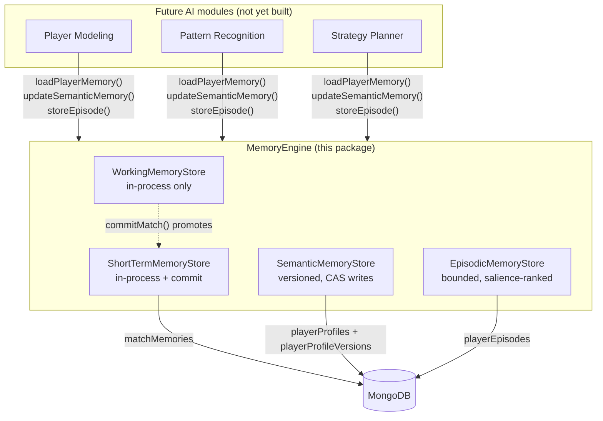

# @adaptive-ai/memory-engine

The persistence, retrieval, and retention mechanism for everything the platform knows about a player.

**This module performs no intelligence.** It does not decide what a player's aggression score should be, what counts as a memorable episode, or when a habit is "real." Every value that requires interpretation (an observation, an importance score, a confidence delta) arrives here already computed by the caller. Memory Engine's job is to store it correctly, version it, retain the right subset, and make it queryable — the *mechanism*, never the *behavior*. That distinction is deliberate (see `ADAPTIVE_AI_ENGINE_WHITEPAPER.md` §4) and is what keeps this module reusable by every future AI subsystem (Player Modeling, Pattern Recognition, Strategy Planner, Decision Engine) without any of them duplicating storage logic.

---

## 1. Architecture



Four per-player memory components (whitepaper §4), one facade:

| Component | Persisted? | Lifetime | Store |
|---|---|---|---|
| **Working Memory** | No | One match, discarded at commit/abandon | `WorkingMemoryStore` — plain in-process `Map`, no database at all |
| **Short-Term Memory** | Yes, at commit only | Accumulates in-process during the match, then durable forever | `ShortTermMemoryStore` — `matchMemories` collection |
| **Long-Term Semantic Memory** | Yes, every update | Forever, fully versioned | `SemanticMemoryStore` — `playerProfiles` + `playerProfileVersions` |
| **Long-Term Episodic Memory** | Yes | Forever, but bounded (top-K per player+game) | `EpisodicMemoryStore` — `playerEpisodes` |

A fifth whitepaper component, **Procedural Memory** (tuned AI weights, platform-level not per-player), is explicitly out of scope here — it belongs to a future ML upgrade path, not to per-player storage.

---

## 2. Data Model

### Working Memory (`WorkingMemoryState`, in-process only)
```ts
{ matchId, playerId, gameId, startedAt, lastTouchedAt,
  plan: Record<string, unknown> | null,        // opaque — Strategy Planner's future concern
  recentObservations: WorkingMemoryObservation[], // bounded ring buffer (default cap 50)
  counters: Record<string, number>,
  context: Record<string, unknown> }
```

### Short-Term Memory (`ShortTermMemoryState` in-process → `MatchMemoryRecord` in `matchMemories`)
```ts
// matchMemories document, written once by commitMatch()
{ matchId, playerId, gameId, startedAt, committedAt, durationMs, summary,
  recentEvents: ShortTermEventRef[],           // bounded, default cap 500
  recentBehaviors: ShortTermBehaviorObservation[], // bounded, default cap 200
  recentDecisions: ShortTermDecisionRef[],     // bounded, default cap 200
  statistics: Record<string, number>,
  schemaVersion: 1 }
```
Deliberately a **separate collection from `matches`** (owned by platform/api / event-pipeline per `PLATFORM_V2_DESIGN.md` §6 — match metadata like outcome/duration/AI personality). Memory Engine owns the *observation log* for a match, not the match's lifecycle record.

### Long-Term Semantic Memory (`playerProfiles` + `playerProfileVersions`)
```ts
// playerProfiles — ONE current doc per (playerId, gameId, dimension)
{ playerId, gameId: string | null, dimension, value, confidence, samples, version, updatedAt }

// playerProfileVersions — append-only, NEVER mutated or deleted
{ ...same fields..., previousVersion: number | null, matchId?, reason? }
```
`gameId: null` marks a **cross-game** dimension (whitepaper §11 — e.g. Reaction Time, Risk Tolerance, Aggression transfer across games in normalized form; Favorite Weapon does not and stays per-game).

### Long-Term Episodic Memory (`playerEpisodes`)
```ts
{ episodeId, playerId, gameId, matchId, timestamp, episodeType,
  summary, importance /* [0,1], caller-supplied salience */,
  confidence /* [0,1], caller-supplied */,
  referencedEvents: string[], createdAt }
```
`episodeType` is an open string union with five named examples (`first-victory`, `major-comeback`, `repeated-trap`, `important-mistake`, `repeated-successful-strategy`) — extensible without a schema change.

---

## 3. Lifecycle

```
MatchStarted  →  engine.startMatch(matchId, playerId, gameId)
                 (Working Memory + Short-Term Memory both begin, in-process)

During match  →  engine.storeWorkingMemory({ matchId, plan, observation, counterIncrement, context })
                 engine.shortTermMemory.recordEvent/recordBehavior/recordDecision/incrementStatistic(matchId, ...)

MatchEnded    →  engine.commitMatch(matchId, summary)
                 - Short-Term Memory → persisted `matchMemories` doc (durable forever)
                 - Working Memory    → destroyed (never was durable — it was scratch space)

Post-match    →  (future Player Modeling) engine.updateSemanticMemory({ playerId, gameId, dimension, observation })
                 (future Pattern Recognition) engine.storeEpisode({ ...importance/confidence already computed })

Crash/abandon →  engine.abandonMatch(matchId)  — discards both, persists nothing
Maintenance   →  engine.deleteExpiredWorkingMemory()   — sweep for matches that never reached MatchEnded
                 engine.pruneExpiredEpisodes()          — optional daily age-based cleanup
```

**Why Working Memory is destroyed but Short-Term Memory survives:** Working Memory is scratch space for the *live* match (whitepaper §4: "a sprawling working-memory representation would make Explainability's job harder, not easier") — it's re-derivable from the match's own event stream and was never meant to be the durable record of anything. Short-Term Memory is exactly the opposite: it's *only* useful once distilled into a summary, at which point it becomes the raw material Player Modeling will fold into the persisted profile.

---

## 4. Confidence Model

`src/confidence.ts` — pure functions, no I/O, whitepaper §3.1 / §12.2 / §12.5:

```
value_new  = value_old + α · (observation − value_old)     // EWMA
confidence = 1 − e^(−samples / k)                            // asymptotic, never reaches 1 (see note)
α          = max(1 / (1 + samples), α_min)
```

- **`k` is tunable per dimension** (`MemoryEngineConfig.confidence.dimensionK`), falling back to `defaultK`. A stable trait (reaction time) should use a larger `k` — trust builds slower but the read is more durable. A context-sensitive dimension (favorite ability this patch) should use a smaller `k`.
- **`α_min`** guarantees learning never fully stalls, however many samples accumulate — a single extreme observation always moves the value by at least `α_min` of the remaining gap.
- **`decayConfidence(confidence, daysSinceUpdate, decayRatePerDay)`** — separate, optional gradual time-decay for dormant dimensions (whitepaper §10's "daily... dormant-dimension confidence decay sweeps"). Exponential, never negative, `samples` is left untouched (decay means "this read might be stale," not "we forgot the evidence").

**Float-precision note:** `1 − e^(−samples/k)` is mathematically guaranteed to stay below 1, but at very large `samples/k` ratios (roughly > 35) the true gap underflows below float64's ~1e-16 relative precision and the expression rounds to *exactly* `1.0` in JavaScript. This is an IEEE 754 artifact, not a flaw in the formula — documented here because it surprised a test during development (see `confidence.test.ts`).

**Concurrency writes never race the math**, only the storage: `SemanticMemoryStore.update()` recomputes the EWMA from a *fresh* read every retry attempt (see §6), so a losing writer never applies its update on top of stale state.

---

## 5. Versioning

Every `updateSemanticMemory()` call creates a **new immutable version** in `playerProfileVersions` and atomically advances the `playerProfiles` "latest pointer" doc to it. Nothing is ever overwritten or deleted:

- `getSemanticHistory(playerId, gameId, dimension)` — full version history, newest first.
- `rollbackSemanticDimension(playerId, gameId, dimension, toVersion)` — restores a prior version's value as **yet another new version** (never by mutating history) — the fact that a rollback happened is itself preserved in the trail (`reason: "rollback-to-vN"`).

### Concurrency (optimistic, not lock-based)

Two concurrent `updateSemanticMemory()` calls for the same `(playerId, gameId, dimension)` never lose an update:

1. Read the current latest doc (or none).
2. Compute the EWMA result from that snapshot.
3. Insert a new version doc at `version = base + 1` — a **unique index** on `(playerId, gameId, dimension, version)` means a losing concurrent writer's insert throws a duplicate-key error instead of silently corrupting history.
4. On success, CAS-update the latest pointer with a filter that requires it still be at `version = base` — if another writer already advanced it, this also fails and triggers a retry.
5. On any conflict, retry from step 1 with fresh state (bounded by `MemoryEngineConfig.semanticWriteMaxRetries`, default 5; throws `SemanticWriteConflictError` if exhausted).

This is validated directly in `semantic-memory.test.ts` ("never loses an update under concurrent writes") by firing 25 concurrent updates at one dimension and asserting the final `samples` count and version sequence are dense and complete.

---

## 6. Retention Strategy

- **Working Memory:** bounded ring buffer (`maxObservations`, default 50) — old observations silently evicted; the whole state is discarded at commit/abandon or swept by `deleteExpiredWorkingMemory()` after `maxIdleMs` (default 6h) of inactivity, which is crash resilience for matches that never send `MatchEnded`.
- **Short-Term Memory:** bounded per-category (`maxEvents`/`maxBehaviors`/`maxDecisions`, defaults 500/200/200) while in-process; the committed summary itself is retained forever (no automatic expiry — that's a product decision left to a future phase, not hardcoded here).
- **Semantic Memory:** never pruned — every version is kept forever by design (this is the audit trail).
- **Episodic Memory:** **top-K by importance** per `(playerId, gameId)`, `maxEpisodesPerPlayerGame` (default 50). Every `storeEpisode()` call immediately re-enforces the cap — an episode that doesn't make the cut is stored then immediately pruned back out, which converges to the same result as pre-checking but is simpler. An optional, independent `maxAgeMs` age-based expiry is available via `pruneExpiredEpisodes()`, intended for a **daily** maintenance cadence (whitepaper §10), not on every write.

---

## 7. Search API

`searchEpisodes(criteria)` / `EpisodicMemoryStore.search()`:

```ts
{ playerId?, gameId?, matchId?, episodeType?,
  fromTs?, toTs?,                    // time range
  minImportance?, minConfidence?,    // thresholds
  sortBy?: 'recent' | 'importance',  // default 'recent'
  limit?, offset? }                  // pagination; returns { episodes, total }
```

Every documented search axis (player, game, match, episode type, time range, importance, confidence, recency) is covered — see `episodic-memory.test.ts` for correctness under a 1,000-episode mixed dataset.

---

## 8. Database Schema & Indexes

```
matchMemories
  matchId (unique), playerId, gameId, startedAt, committedAt, durationMs,
  summary, recentEvents[], recentBehaviors[], recentDecisions[], statistics, schemaVersion
  Indexes: {matchId} unique, {playerId, committedAt desc}, {gameId, committedAt desc}

playerProfiles                       (latest value per dimension — O(1) profile reads)
  playerId, gameId, dimension, value, confidence, samples, version, updatedAt
  Indexes: {playerId, gameId, dimension} unique, {playerId} (fast whole-profile scan)

playerProfileVersions                (append-only history — never overwritten)
  ...same fields..., previousVersion, matchId?, reason?
  Indexes: {playerId, gameId, dimension, version} unique, {playerId, gameId, dimension, updatedAt desc}

playerEpisodes
  episodeId, playerId, gameId, matchId, timestamp, episodeType, summary,
  importance, confidence, referencedEvents[], createdAt
  Indexes: {episodeId} unique, {playerId, gameId, importance desc} (retention + top-K),
           {playerId, gameId, timestamp desc} (recency search), {episodeType}, {matchId}
```

Designed for millions of events per the task brief: every hot-path query (latest profile lookup, episode retrieval, time-range search) is backed by a compound index that matches its actual filter+sort shape, and `playerProfiles`/`playerProfileVersions` split keeps "give me the current value" (O(1), tiny doc) separate from "give me the history" (append-only, never touched by the hot path).

---

## 9. Public API

```ts
const engine = new MemoryEngine({ db, config?, logger? });
await engine.initialize(); // creates all indexes — call once at startup

// Match lifecycle
engine.startMatch(matchId, playerId, gameId);
engine.storeWorkingMemory({ matchId, plan?, observation?, counterIncrement?, context? });
await engine.commitMatch(matchId, summary?);         // -> MatchMemoryRecord
engine.abandonMatch(matchId);                         // crash/disconnect, persists nothing
engine.deleteExpiredWorkingMemory(now?, maxIdleMs?);  // -> matchIds swept

// Semantic memory
await engine.updateSemanticMemory({ playerId, gameId, dimension, observation, k?, matchId?, reason? });
await engine.getSemanticProfile(playerId, gameId?);   // -> SemanticDimensionState[]
await engine.getSemanticHistory(playerId, gameId, dimension, limit?);
await engine.rollbackSemanticDimension(playerId, gameId, dimension, toVersion);

// Episodic memory
await engine.storeEpisode({ playerId, gameId, matchId, timestamp, episodeType, summary, importance, confidence, referencedEvents });
await engine.searchEpisodes({ playerId?, gameId?, ... });  // -> { episodes, total }
await engine.pruneExpiredEpisodes(now?);                   // daily maintenance cadence

// Aggregate "single source of truth" read
await engine.loadPlayerMemory(playerId, gameId?, { recentMatchLimit?, topEpisodesLimit? });
// -> { playerId, gameId, semanticProfile, recentMatches, topEpisodes, loadedAt }
```

Granular per-store operations (`engine.workingMemory.pushObservation(...)`, `engine.shortTermMemory.recordEvent(...)`, etc.) remain available as an escape hatch for callers that need finer control than the facade's convenience methods — the stores themselves already fully hide MongoDB (callers never see a `Db`, a `Collection`, or a Mongo query shape).

### Example: a full match

```ts
engine.startMatch('match-1', 'player-1', 'arena-game');
engine.storeWorkingMemory({ matchId: 'match-1', plan: { focus: 'aggressive' } });
engine.shortTermMemory.recordBehavior('match-1', { ts: Date.now(), dimension: 'aggression', value: 0.9 });

const matchRecord = await engine.commitMatch('match-1', 'victory');

// Player Modeling (future phase) folds the observation into the profile:
await engine.updateSemanticMemory({
  playerId: 'player-1', gameId: 'arena-game', dimension: 'aggression',
  observation: matchRecord.recentBehaviors[0].value, matchId: 'match-1',
});

// Pattern Recognition (future phase) flags a notable encounter:
await engine.storeEpisode({
  playerId: 'player-1', gameId: 'arena-game', matchId: 'match-1', timestamp: Date.now(),
  episodeType: 'first-victory', summary: 'Won their very first match with an aggressive strategy.',
  importance: 0.95, confidence: 0.9, referencedEvents: [],
});

// Decision Engine (future phase) reads everything back in one call:
const memory = await engine.loadPlayerMemory('player-1', 'arena-game');
```

---

## 10. Performance

| Operation | Complexity (real MongoDB, with declared indexes) |
|---|---|
| `updateSemanticMemory` | O(1) amortized — 1 indexed read + 1 indexed insert + 1 indexed CAS update, retried only under actual write contention |
| `getSemanticProfile` | O(k) where k = number of dimensions for the player (indexed scan on `{playerId}` or `{playerId, gameId}`) |
| `storeEpisode` | O(1) insert + O(log n) retention check against the `{playerId, gameId, importance}` index |
| `searchEpisodes` | O(page size + index seek), never a full collection scan given the declared compound indexes |
| `commitMatch` | O(1) — one insert |

Measured (against the in-memory test fake, not real Mongo — see caveat below): 5,000 sequential semantic updates in ~3s (~0.6ms/update); 500 match commits in ~105ms; 2,000 episodes across 10 players with retention enforcement in ~226ms. Raw numbers in `src/__tests__/results/performance-results.json`.

**Caveat, stated plainly:** all of the above numbers come from `FakeDb` (`src/__tests__/fake-mongo.ts`), an in-memory double used because this sandbox has no reliable network access to a real `mongod` binary — the same constraint documented in `@adaptive-ai/event-pipeline`. `FakeCollection` does a **linear scan** per `find`/`findOne`/unique-constraint check, so its own performance characteristics degrade with collection size in a way real MongoDB's B-tree indexes would not. One test (`performance.test.ts` "per-update cost at history depth 2500...") observes and documents this directly rather than pretending otherwise. **Re-validate against real MongoDB before trusting these numbers at production scale.**

---

## 11. Known Limitations

1. **Never tested against real MongoDB** (see Performance caveat above) — index behavior, real write-lock contention, and true query-planner performance are unvalidated.
2. **No automatic expiry for `matchMemories`** — every committed match's short-term summary is kept forever unless a future phase adds a retention policy. Not an oversight; a product decision intentionally left open.
3. **CAS retries under very high contention (many concurrent writers on one dimension) do more Mongo round-trips than a pessimistic lock would.** Acceptable at expected per-match-cadence write volume (whitepaper §10: updates happen once per match, not per-tick), but worth knowing if a future caller ever tries to update the same dimension at high frequency from many processes at once.
4. **Working Memory has no cross-process sharing** — it's a plain in-process `Map`. A multi-instance deployment routing a match's requests to different processes would need working memory to move to something shared (e.g. Redis) or for match affinity to be guaranteed at the load-balancer level. Not needed at current scale; flagged for whoever scales this out.
5. **`decayConfidence` is a primitive, not a scheduled job** — nothing in this package currently calls it on a cadence. Wiring "run this daily over dormant dimensions" is a future phase's job (Long-Term Memory module, per `PLATFORM_V2_DESIGN.md` §5.9), consistent with this package being mechanism-only.

---

## 12. Integration Points for Future AI Modules

| Future module | What it will read | What it will write |
|---|---|---|
| **Behavior Analysis** | — (stateless stream processor) | `shortTermMemory.recordBehavior()` during the match |
| **Player Modeling** | `getSemanticProfile()`, `loadPlayerMemory()` | `updateSemanticMemory()` at match end, from committed `MatchMemoryRecord.recentBehaviors` |
| **Pattern Recognition** | `getSemanticHistory()` (for trend detection), raw `shortTermMemory` event logs | `storeEpisode()` when a notable encounter is detected; conceptually also `playerPatterns` (a separate collection this phase does NOT implement — Pattern Recognition owns its own storage need there, out of scope per this phase's instructions) |
| **Strategy Planner** | `loadPlayerMemory()` (semantic profile + top episodes) | `storeWorkingMemory({ plan })` each planning cycle |
| **Decision Engine** | `workingMemory.get(matchId)` (the active plan + context) | `shortTermMemory.recordDecision()` per tick |
| **Explainability** | `searchEpisodes()` + `getSemanticHistory()` (sourcing a human-readable "why") | — (read-only) |
| **Long-Term Memory** (retention/decay policy module) | — | Calls `decayConfidence()` and `pruneExpiredEpisodes()` on whatever cadence it decides — this package provides the primitives, that module owns the schedule and the "should we decay this dimension" judgment |

No future module should ever construct its own MongoDB collection for player-observation data — if it needs a new *kind* of fact stored, that's a signal to extend this package's schema (a new dimension name, a new episode type, a new short-term field), not to bypass it.
